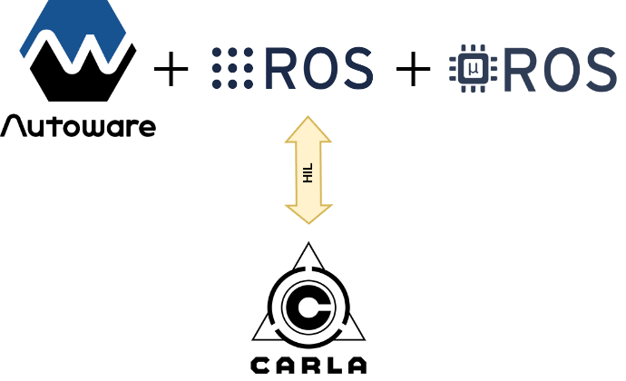
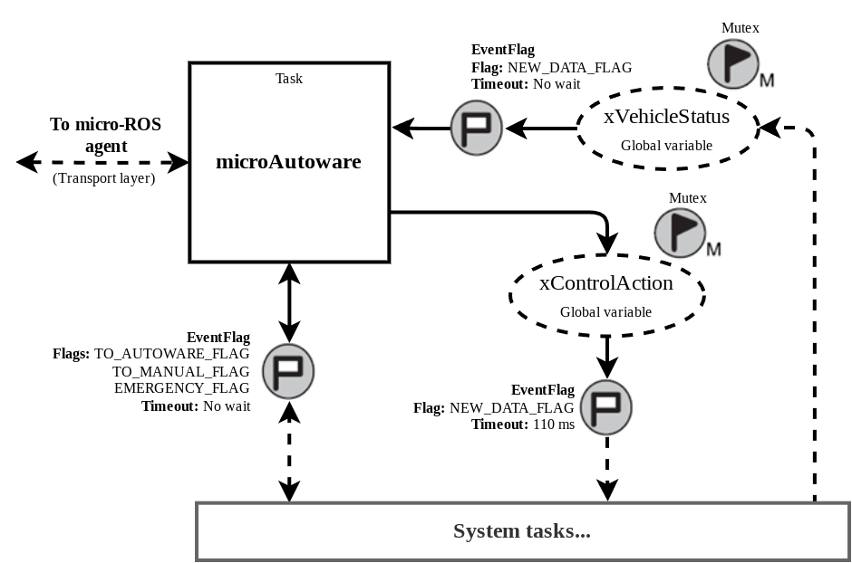
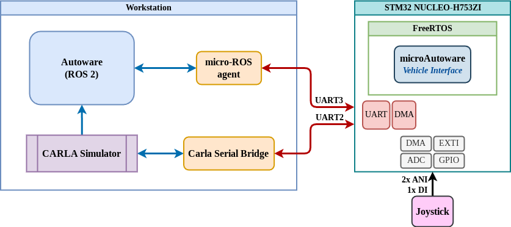

# microAutoware: An Autoware vehicle interface for real-time embedded systems

microAutoware is a package based in micro-ROS to bring the Autoware Core/Universe inside a microcontroller with Hardware-In-the-Loop (HIL) validation support.

---

## Introduction

## microAutoware lib

- `microAutoware.h`
  - Header file including: micro-ROS libraries, Autoware libraries, defining flags, declaring structs typedefs and function prototypes.
- `microAutoware.c`
  - microAutoware task, that implement the micro-ROS node and declare package's global variables. 
- `microAutoware_config.h`
  - Header file to configure microAutoware parameters, as timeouts, timing, transport layer and node name.

## Creating project in STM32CubeIDE

STM32CubeIDE 1.15.1

1. After create your project in STM32CubeIDE, the first step is configure the *code generation*:

    - In your `.ioc` file go to: `Project Manager > Code Generator`;
    - Check `Generate peripheral initialization as a pair of 'c/.h' files per peripheral`.

2. Once you configured the FreeRTOS using CMSIS_V2, is necessary to create the microAutoware tasks and RTOS entities:

    - Again in the `.ioc` file, go to: `Pinout & Configuration > Middleware and Software > FREERTOS > Configuration > Tasks and Queues`;
      - Create microAutoware task as below:
    
          | Field                  | Parameter          |
          | ---------------------- | ------------------ |
          | Task Name              | TaskMicroAutowa    |
          | Priority               | osPriorityNormal   |
          | Stack Size (Words)     | 4500               |
          | Entry Function         | StartMicroAutoware |
          | Code Generation Option | As external        |
          | Parameter              | NULL               |
          | Allocation             | Dynamic            |
          | Buffer Name            | NULL               |
          | Control Block Name     | NULL               |

    - Now, the mutexes are created in `Pinout & Configuration > Middleware and Software > FREERTOS > Configuration > Mutexes`
      - Create microAutoware mutexes as below:

        1. MutexVehicleStatus

            | Field              | Parameter          |
            | ------------------ | ------------------ |
            | Mutex Name         | MutexVehicleStatus |
            | Allocation         | Dynamic            |
            | Control Block Name | NULL               |

        2. MutexControlAction

            | Field              | Parameter          |
            | ------------------ | ------------------ |
            | Mutex Name         | MutexControlAction |
            | Allocation         | Dynamic            |
            | Control Block Name | NULL               |

3. Configure micro-ROS for microAutoware: [microautoware_micro-ROS_stm32 project configuration](https://github.com/LMA-FEM-UNICAMP/microautoware_micro-ROS_stm32?tab=readme-ov-file#using-this-package-with-stm32cubeide)

## Integrating microAutoware

- Script that copies libs to project

## HIL Mode 

1. To use the HIL testbed, is needed to configure the TaskControle task, as follow:

   - In the `.ioc` file, go to: `Pinout & Configuration > Middleware and Software > FREERTOS > Configuration > Tasks and Queues`;
       - Create TaskControle task as below:
       
           | Field                  | Parameter             |
           | ---------------------- | --------------------- |
           | Task Name              | TaskControle          |
           | Priority               | osPriorityAboveNormal |
           | Stack Size (Words)     | 1500                  |
           | Entry Function         | SartTaskControle      |
           | Code Generation Option | As weak               |
           | Parameter              | NULL                  |
           | Allocation             | Dynamic               |
           | Buffer Name            | NULL                  |
           | Control Block Name     | NULL                  |

2. Finally, set the `USE_SIM_TIME` constant in `microAutoware_config.h` to `true`.