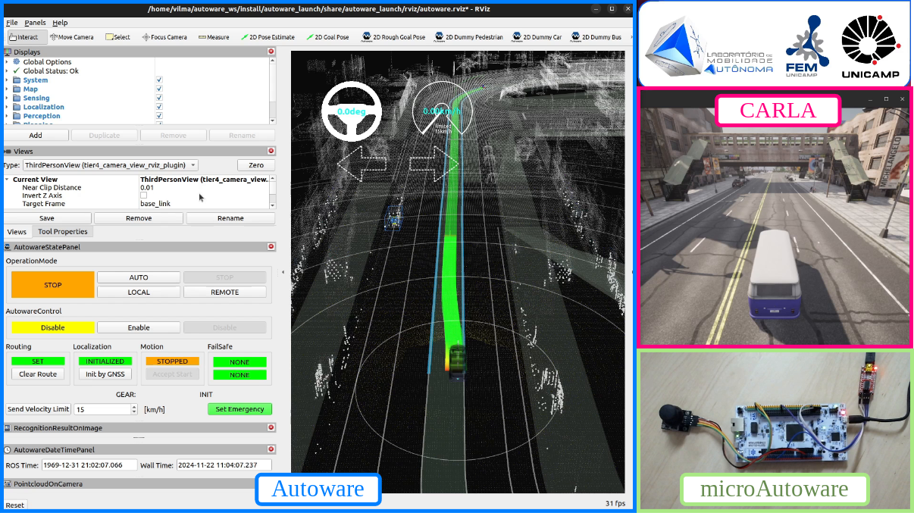

# microAutoware: An Autoware vehicle interface for real-time embedded systems

microAutoware is a package based in micro-ROS to bring the Autoware Core/Universe inside a microcontroller with Hardware-In-the-Loop (HIL) validation support.

<div align="center">

[](https://www.linux.org/) [](https://docs.ros.org/en/humble/index.html) [](https://www.st.com/en/microcontrollers-microprocessors/stm32-32-bit-arm-cortex-mcus.html)

</div>


<p align="center">
  
</p>

<p align="center">
  
</p>
<p align="center">
  
</p>

---

## Introduction

Looking to bring standardization to the Autoware Core/Universe interface with the vehicle's low-level modules, microAutoware utilizes micro-ROS to embed the vehicle interface module inside the microcontroller, using the default ROS2 topics and services to control the vehicle. Another advantage of this package is its independence from the physical layer, where data between Autoware and microAutoware can be transmitted through UART (as validated in this repository), Ethernet, or other micro-ROS-compatible protocols.

As of now, microAutoware is available only for STM32 microcontrollers using FreeRTOS, but there are future plans to expand compatibility to other hardware families and RTOSes.


<p align="center">
  
</p>

<p align="center">
  
</p>

In FreeRTOS, microAutoware is implemented as a task that communicates and synchronizes with other tasks using event flags and global variables protected by a mutex.

<p align="center">
  
</p>

<p align="center">
  
</p>

## Dependencies

- ROS 2 Humble
- Autoware Core/Universe 2024.01
- STM32 microcontroller that supports micro-ROS
- For HIL testbed:
  - CARLA Simulator 0.9.15


## microAutoware lib

- `microAutoware.h`
  - Header file including: micro-ROS libraries, Autoware libraries, defining flags, declaring structs typedefs and function prototypes.
- `microAutoware.c`
  - microAutoware task, that implement the micro-ROS node and declare package's global variables. 
- `microAutoware_config.h`
  - Header file to configure microAutoware parameters, as timeouts, timing, transport layer and node name.
- `executorCallbacks.c`
  - Declaration of micro-ROS callback functions for timers, topics and services.

## Creating project in STM32CubeIDE

STM32CubeIDE 1.15.1

1. After create your project in STM32CubeIDE, the first step is configure the *code generation*:

    - In your `.ioc` file go to: `Project Manager > Code Generator`;
    - Check `Generate peripheral initialization as a pair of 'c/.h' files per peripheral`.

2. Once you configured the FreeRTOS using CMSIS_V2, is necessary to create the microAutoware tasks and RTOS entities:

    - Again in the `.ioc` file, go to: `Pinout & Configuration > Middleware and Software > FREERTOS > Configuration > Tasks and Queues`;
      - Create microAutoware task as below:
    
          | Field                  | Parameter          |
          | ---------------------- | ------------------ |
          | Task Name              | TaskMicroAutowa    |
          | Priority               | osPriorityNormal   |
          | Stack Size (Words)     | 4500               |
          | Entry Function         | StartMicroAutoware |
          | Code Generation Option | As external        |
          | Parameter              | NULL               |
          | Allocation             | Dynamic            |
          | Buffer Name            | NULL               |
          | Control Block Name     | NULL               |

          > It's important that microAutoware task don't stay blocked for long once the executor runs periodically. Thus, is important to evaluate `TaskMicroAutowa` priority to avoid starvation.

    - Now, the mutexes are created in `Pinout & Configuration > Middleware and Software > FREERTOS > Configuration > Mutexes`;
      - Create microAutoware mutexes as below:

        1. MutexVehicleStatus

            | Field              | Parameter          |
            | ------------------ | ------------------ |
            | Mutex Name         | MutexVehicleStatus |
            | Allocation         | Dynamic            |
            | Control Block Name | NULL               |

        2. MutexControlAction

            | Field              | Parameter          |
            | ------------------ | ------------------ |
            | Mutex Name         | MutexControlAction |
            | Allocation         | Dynamic            |
            | Control Block Name | NULL               |

    - Finally, is necessary to create the event flag object, going to `Pinout & Configuration > Middleware and Software > FREERTOS > Configuration > Events`;
      - Create microAutoware event flags as below:

        | Field              | Parameter           |
        | ------------------ | ------------------- |
        | Event flags Name   | EventsMicroAutoware |
        | Allocation         | Dynamic             |
        | Control Block Name | NULL                |


3. Copy `microAutoware_config.h` and `microAutoware.h` to `Core/Inc` project folder;

4. Copy `microAutoware.c` and `executorCallbacks.c` to `Core/Src` project folder;

5. Clone micro-ROS for microAutoware repository:

```shell
git clone -b humble git@github.com:LMA-FEM-UNICAMP/microautoware_micro-ROS_stm32.git
```


6. Configure micro-ROS for microAutoware [[1]](#ref1): [microautoware_micro-ROS_stm32 project configuration](https://github.com/LMA-FEM-UNICAMP/microautoware_micro-ROS_stm32?tab=readme-ov-file#using-this-package-with-stm32cubeide).


### Global variables

#### `xVehicleStatus`

- Collect vehicle information to publish in Autoware.

- Type: `vehicle_status`
  
  | Variable          | Type    | Description               |
  | ----------------- | ------- | ------------------------- |
  | `xLongSpeed`      | `float` | Longitudinal speed (m/s)  |
  | `xLatSpeed`       | `float` | Lateral speed (m/s)       |
  | `xHeadingRate`    | `float` | Heading rate (rad/s)      |
  | `xSteeringStatus` | `float` | Steering tire angle (rad) |

#### `xControlAction`

- Compact Autoware's high-level control references to embedded system low-level control tasks.

- Type: `control_action`
  
  | Variable            | Type            | Description                     |
  | ------------------- | --------------- | ------------------------------- |
  | `xSteeringAngle`    | `float`         | Steering tire angle (rad)       |
  | `xSteeringVelocity` | `float`         | Steering tire speed (rad/s)     |
  | `xSpeed`            | `float`         | Speed (m/s)                     |
  | `xAcceleration`     | `float`         | Acceleration (m/s^2 )           |
  | `xJerk`             | `float`         | Jerk (m/s^3)                    |
  | `ucControlMode`     | `unsigned char` | Vehicle control mode (HIL only) |

### Flags

#### `VEHICLE_DATA_UPDATED_FLAG`

Once the vehicle information to the Autoware are ready, the `VEHICLE_DATA_UPDATED_FLAG` is set to microAutoware and sends that data through ROS.

- Pooling flag to microAutoware task.

#### `AUTOWARE_DATA_UPDATED_FLAG`

When microAutoware receives Autoware's data and updates `xControlAction`, the `AUTOWARE_DATA_UPDATED_FLAG` is set to system tasks to process that information.

- Blocks control task.

#### Change control mode flags


A command to change the vehicle's control mode can be executed from either Autoware or the vehicle, i.e., there is a two-way control mode change. Therefore, the flags to activate the mode change were split into two flags for each function, with the prefix `MA_` when the command comes from the vehicle and `SYS_` when it comes from Autoware.

Both the `TO_AUTOWARE_MODE`, `TO_MANUAL_MODE`, and `EMERGENCY_MODE` flags are non-blocking and are polled at the start of the execution of the microAutoware task, as well as in the system task designed in the HIL package. The last two flags are used for fail-safe capabilities, and the last one is used exclusively for this purpose.


#### `MICRO_ROS_AGENT_ONLINE_FLAG`

When the embedded system is powered on, microAutoware tries to connect to the micro-ROS agent to establish communication with Autoware, and the system task loops are blocked. When this occurs, the `MICRO_ROS_AGENT_ONLINE_FLAG` flag is set, unblocking the system tasks. This flag has a timeout, and if the high-level system does not connect to the low-level system, the embedded system powers up in manual mode only.


## HIL Mode 

<p align="center">
  
</p>

<p align="center">
  
</p>

<p align="center">
  
</p>

<p align="center">
  
</p>

### Embedded system configuration

1. To use the HIL testbed, is needed to configure the TaskControle task, as follow:


   - In the `.ioc` file, go to: `Pinout & Configuration > Middleware and Software > FREERTOS > Configuration > Tasks and Queues`;
       - Create TaskControle task as below:
       
           | Field                  | Parameter             |
           | ---------------------- | --------------------- |
           | Task Name              | TaskControl           |
           | Priority               | osPriorityAboveNormal |
           | Stack Size (Words)     | 1500                  |
           | Entry Function         | StartTaskControl      |
           | Code Generation Option | As weak               |
           | Parameter              | NULL                  |
           | Allocation             | Dynamic               |
           | Buffer Name            | NULL                  |
           | Control Block Name     | NULL                  |

2. Finally, set the `USE_SIM_TIME` constant in `microAutoware_config.h` to `true`.

### Autoware + CARLA configuration

The HIL testbed uses the [Carla-Autoware-Bridge](https://github.com/LMA-FEM-UNICAMP/Carla-Autoware-Bridge), forked from [[2]](#ref2) to work within microAutoware. Is necessary to follow the instructions of the repository.

### microAutoware + CARLA configuration

To communicate the embedded system with the CARLA Simulator, the serial-ROS package [carla_serial_bridge](https://github.com/LMA-FEM-UNICAMP/carla_serial_bridge) is used, but another strategies could be explored if it's of interest. micro-ROS aren't employed to this function to avoid overheading of the framework with the simulated vehicle data that in real world don't flow through then.

### Running HIL testbed

1. Launch CARLA Simulator

```sh
./CarlaUE4.sh -carla-rpc-port=1403
```

2. Launch Carla-Autoware-Bridge

```sh
ros2 launch carla_autoware_bridge carla_aw_bridge.launch.py port:=1403 town:=Town10HD timeout:=100
```

3. Launch carla_serial_bridge

```sh
ros2 run carla_serial_bridge carla_serial_bridge_node
```

4. Launch micro-ROS agent

```sh
ros2 run micro_ros_agent micro_ros_agent serial --dev /dev/ttyACM0 -b 921600
```

5. Launch Autoware Core/Universe

```sh
ros2 launch autoware_launch e2e_simulator.launch.xml vehicle_model:=carla_t2_vehicle sensor_model:=carla_t2_sensor_kit map_path:=/home/vilma/autoware_ws/maps/carla-autoware-bridge/Town10
```

6. Set third view camera in CARLA Simulator (optional)

```sh
python src/Carla-Autoware-Bridge/utils/thirdview_camera.py
```

> 1, 2, 3 and 4 could be compacted in a single launch file

## References


<a id="ref1"></a> [1] micro-ROS for STM32CubeMX/IDE. Available in: [github.com/micro-ROS/micro_ros_stm32cubemx_utils](https://github.com/micro-ROS/micro_ros_stm32cubemx_utils)


<a id="ref2"></a> [2] G. Kaljavesi, T. Kerbl, T. Betz, K. Mitkovskii and F. Diermeyer, "CARLA-Autoware-Bridge: Facilitating Autonomous Driving Research with a Unified Framework for Simulation and Module Development," 2024 IEEE Intelligent Vehicles Symposium (IV), Jeju Island, Korea, Republic of, 2024, pp. 224-229, doi: 10.1109/IV55156.2024.10588623.
