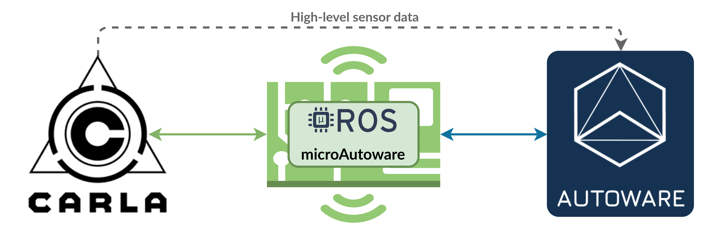
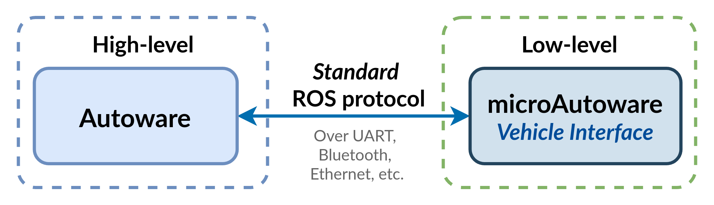
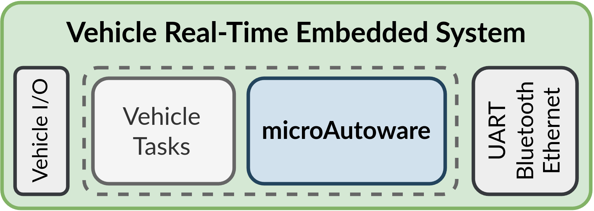
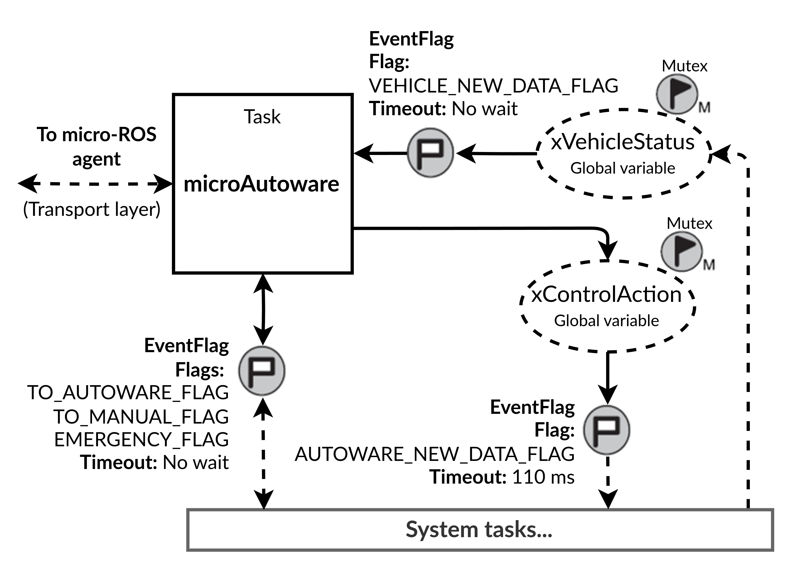

# microAutoware: An Autoware Vehicle Interface for Real-Time Embedded Systems

microAutoware is a package based on micro-ROS to bring the Autoware Core/Universe inside a microcontroller with Hardware-In-the-Loop (HIL) validation support.

<div align="center">

[](https://www.linux.org/) [](https://docs.ros.org/en/humble/index.html) [](https://www.st.com/en/microcontrollers-microprocessors/stm32-32-bit-arm-cortex-mcus.html) [](https://github.com/autowarefoundation/autoware/tree/2024.01)

</div>


<p align="center">
  
</p>
<p align="center">
  
</p>

---

## Introduction


Looking to bring standardization to the Autoware Core/Universe interface with the vehicle's low-level modules, microAutoware utilizes micro-ROS to embed the vehicle interface module inside the microcontroller, using the default ROS2 topics and services to control the vehicle. Another advantage of this package is its independence from the physical layer, allowing data to be transmitted between Autoware and microAutoware through UART (as validated in this repository), Ethernet, or other micro-ROS-compatible protocols. Acess the
[Graphical abstract](docs/figures/graphical_abstract.png).

Currently, microAutoware is only available for STM32 microcontrollers using FreeRTOS; however, plans are in place to expand compatibility to other hardware families and RTOSes.

<p align="center">
  
</p>

In FreeRTOS, microAutoware is implemented as a task that communicates and synchronizes with other tasks using event flags and global variables protected by a mutex.

<p align="center">
  
</p>

<p align="center">
  
</p>

## Dependencies

- ROS 2 Humble
- Autoware Core/Universe 2024.01
- STM32 microcontroller that supports micro-ROS
- For HIL testbed:
  - CARLA Simulator 0.9.15


## microAutoware lib

- `microAutoware.h`
  - Header file including: micro-ROS libraries, Autoware libraries, defining flags, declaring structs, typedefs, and function prototypes.
- `microAutoware.c`
  - microAutoware task, which implements the micro-ROS node and declares the package's global variables. 
- `microAutoware_config.h`
  - Header file to configure microAutoware parameters, as timeouts, timing, transport layer, and node name.
- `executorCallbacks.c`
  - Declaration of micro-ROS callback functions for timers, topic,s and services.


## [Creating project in STM32CubeIDE](docs/CREATE_PROJECT.md)

## [HIL Mode](docs/HIL.md)


## Citation

Get more information in the microAutoware paper: [10.1109/IV64158.2025.11097536](https://doi.org/10.1109/IV64158.2025.11097536).

Please cite us if you are using our tool (and let us know about your experience)!

```
@INPROCEEDINGS{darocha2025microautoware,
  author={Da Rocha, Gabriel Toffanetto França and Bacurau, Rodrigo Moreira and Ferreira, Janito Vaqueiro},
  booktitle={2025 IEEE Intelligent Vehicles Symposium (IV)}, 
  title={microAutoware: An Autoware Vehicle Interface Designed for Real-Time Embedded Systems with Hardware-In-the-Loop (HIL) Support}, 
  year={2025},
  volume={},
  number={},
  pages={1546-1551},
  doi={10.1109/IV64158.2025.11097536}}

```

## References


<a id="ref1"></a> [1] micro-ROS for STM32CubeMX/IDE. Available in: [github.com/micro-ROS/micro_ros_stm32cubemx_utils](https://github.com/micro-ROS/micro_ros_stm32cubemx_utils).


<a id="ref2"></a> [2] G. Kaljavesi, T. Kerbl, T. Betz, K. Mitkovskii and F. Diermeyer, "CARLA-Autoware-Bridge: Facilitating Autonomous Driving Research with a Unified Framework for Simulation and Module Development," 2024 IEEE Intelligent Vehicles Symposium (IV), Jeju Island, Korea, Republic of, 2024, pp. 224-229, doi: 10.1109/IV55156.2024.10588623. Available in: [github.com/TUMFTM/Carla-Autoware-Bridge](https://github.com/TUMFTM/Carla-Autoware-Bridge).
