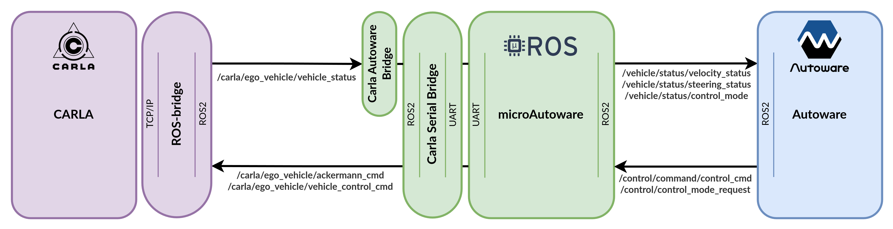
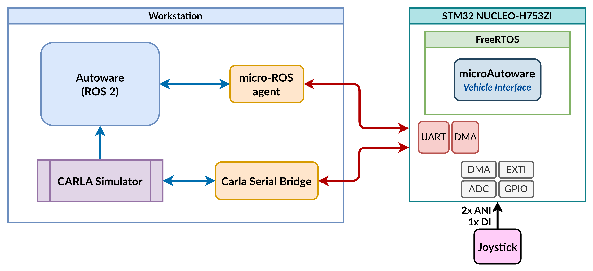

## HIL Mode 

HIL topics:

<p align="center">
  
</p>

In the example used to validate the paper and available in the repository, the following setup was used:

<p align="center">
  
</p>

### Embedded system configuration

1. To use the HIL testbed, is needed to configure the TaskControle task, as follow:


   - In the `.ioc` file, go to: `Pinout & Configuration > Middleware and Software > FREERTOS > Configuration > Tasks and Queues`;
       - Create TaskControle task as below:
       
           | Field                  | Parameter             |
           | ---------------------- | --------------------- |
           | Task Name              | TaskControl           |
           | Priority               | osPriorityAboveNormal |
           | Stack Size (Words)     | 1500                  |
           | Entry Function         | StartTaskControl      |
           | Code Generation Option | As weak               |
           | Parameter              | NULL                  |
           | Allocation             | Dynamic               |
           | Buffer Name            | NULL                  |
           | Control Block Name     | NULL                  |

2. Finally, set the `USE_SIM_TIME` constant in `microAutoware_config.h` to `true`.

### Autoware + CARLA configuration

The HIL testbed uses the [Carla-Autoware-Bridge](https://github.com/LMA-FEM-UNICAMP/Carla-Autoware-Bridge), forked from [[2]](#ref2) to work within microAutoware. Is necessary to follow the instructions of the repository.

### microAutoware + CARLA configuration

To communicate the embedded system with the CARLA Simulator, the serial-ROS package [carla_serial_bridge](https://github.com/LMA-FEM-UNICAMP/carla_serial_bridge) is used, but another strategies could be explored if it's of interest. micro-ROS aren't employed to this function to avoid overheading of the framework with the simulated vehicle data that in real world don't flow through then.

### Running HIL testbed

1. Launch CARLA Simulator

```sh
./CarlaUE4.sh -carla-rpc-port=1403
```

2. Launch Carla-Autoware-Bridge

```sh
ros2 launch carla_autoware_bridge carla_aw_bridge.launch.py port:=1403 town:=Town10HD timeout:=100
```

3. Launch carla_serial_bridge

```sh
ros2 run carla_serial_bridge carla_serial_bridge_node
```

4. Launch micro-ROS agent

```sh
ros2 run micro_ros_agent micro_ros_agent serial --dev /dev/ttyACM0 -b 921600
```

5. Launch Autoware Core/Universe

```sh
ros2 launch autoware_launch e2e_simulator.launch.xml vehicle_model:=carla_t2_vehicle sensor_model:=carla_t2_sensor_kit map_path:=/home/vilma/autoware_ws/maps/carla-autoware-bridge/Town10
```

6. Set third view camera in CARLA Simulator (optional)

```sh
python src/Carla-Autoware-Bridge/utils/thirdview_camera.py
```

> 1, 2, 3 and 4 could be compacted in a single launch file